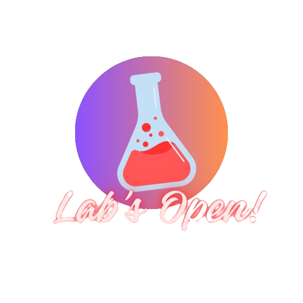

<!--START_SECTION:header-->

  

     
    <h1>Gerador de QRcode para e-commerce</h1>
  

<!--END_SECTION:header-->

  
  

<!--  -->
<table align="center">
<thead>
  <tr>
    <td>
        
Junior

        <a href="https://github.com/Alxdelira">
         
      </a>
    </td>
    <td colspan="3">
    
🎉 3y+ em desenvolvimento com NEXT.JS JAVASCRIPT e NODE.JS.
       
     🌟 Desenvolvedor fullstack - Procurando uma solução pros problemas do Mundo!
       
    👨‍💻 Foco em Desenvolvimento de Software para WEB.
    

      
        
    </td>
  </tr>
</thead>
</table>
<!--  -->

 
 

## 💻 Sobre o Projeto

Vamos construir um kit de utilidades para um e-commerce, o projeto deve ser escalável para ter adição de novas features.

## 📚 Pré-requisitos de Habilidades e Níveis de Conhecimento

Antes de ingressar neste conteúdo, é necessário possuir conhecimento prévio nas seguintes áreas:

- Lógica de programação
- Javascript | Básico
- NodeJS | Básico
- Node Modules
- NPM, Packages, Dependencies
- Variáveis ambiente (.env)

## 🛠️ Habilidades e Sub-habilidades que vamos aprender neste conteúdo

- Como gerar qrcode com node
- Como lidar com várias dependências de um projeto
- Como pensar em projetos por camadas

## 🎯 Objetivos e Resultados Esperados

Após a conclusão do curso/projeto, os estudantes estarão aptos a:

- Criar projetos nodejs que gerem multiplas dependências

<!--START_SECTION:footer-->

 
 

  

